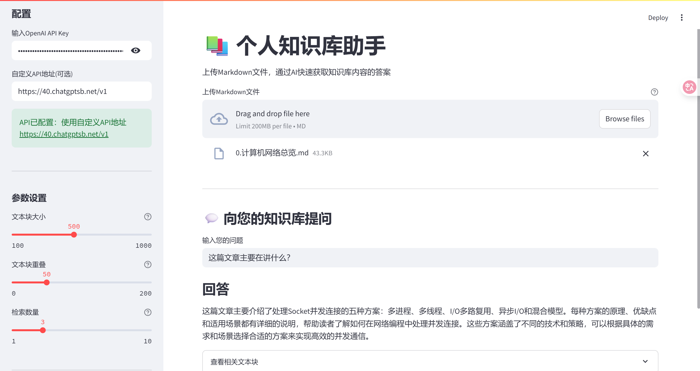

# 个人知识库助手



这是一个基于 Streamlit 和 OpenAI API/兼容API 开发的个人知识库问答助手，帮助你从 Markdown 文档中快速获取信息。

## 主要特性

- 支持上传 Markdown 格式的笔记文件
- 自动解析、切分和向量化文本内容
- 基于语义相似度检索相关内容
- 使用大型语言模型（LLM）生成准确的问答回复
- 支持自定义 OpenAI 兼容 API 地址（如第三方API、本地API等）
- embedding 和 chat 均可用，适配官方和第三方API
- 简洁友好的 Streamlit 用户界面

## 快速开始

### 前提条件

- Python 3.8 或更高版本
- OpenAI API 密钥 或 兼容API密钥（如第三方API）

### 安装步骤

1. 克隆本仓库或下载源代码

```bash
git clone https://github.com/yourusername/md_helper.git
cd md_helper
```

2. 安装所需依赖

```bash
pip install -r requirements.txt
```

3. （可选）创建并激活虚拟环境

```powershell
python -m venv venv
.\venv\Scripts\activate
```

4. 运行应用

```bash
streamlit run app.py
```

5. 在浏览器中访问应用（通常是 http://localhost:8501）

### 使用方法

1. 在侧边栏输入你的 OpenAI API Key
2. 如需使用第三方API或自建API，填写自定义API地址（如 https://xxx.com/v1）
   - 支持自动去除 /chat/completions、/embeddings 等后缀，只需填写基础URL
3. 上传一个 Markdown (.md) 文件
4. 等待系统处理文件（文本切分和向量化）
5. 在问答框中输入你的问题
6. 获取基于你知识库内容的回答

## 项目结构

```
md_helper/
├── app.py                   # Streamlit 主程序
├── modules/
│   ├── markdown_loader.py   # Markdown 文件加载和文本提取
│   ├── text_splitter.py     # 文本切分
│   ├── embedder.py          # OpenAI Embedding 调用（支持自定义API）
│   ├── retriever.py         # 向量检索算法
│   ├── qa_chain_new.py      # 问答流程和 LLM 调用（支持自定义API）
│   └── ...
├── requirements.txt         # 所需依赖库
├── README.md                # 项目说明
```

## 技术选型

- 前端界面：Streamlit
- Markdown 解析：Python markdown 库
- 文本向量化：OpenAI Embedding API 或兼容API
- 问答生成：OpenAI GPT API 或兼容API
- 向量检索：基于余弦相似度的内存检索

## 注意事项

- 本应用支持 OpenAI 官方API 及大部分兼容API（如第三方API、本地API等）
- 侧边栏配置的 API Key 和 API 地址会自动生效，embedding/chat 均走你配置的API
- 不再使用 openai.api_key/openai.api_base 全局变量，避免请求被转发到官方API
- 较大的文件处理可能需要更多时间和 API 调用
- 如遇 401/404 错误，请检查 API Key、API 地址及目标API是否支持 embedding/chat

## 常见问题

- **401 错误**：API Key 无效或不被目标API支持
- **404 错误**：目标API不支持 embedding 或 chat 端点
- **API 客户端未初始化**：请先在侧边栏正确填写 API Key 和 API 地址

## 贡献

欢迎提交问题和拉取请求，共同改进这个项目！

---

本项目已适配自定义API和多种OpenAI兼容API，适合个人和团队本地知识库智能问答场景。
