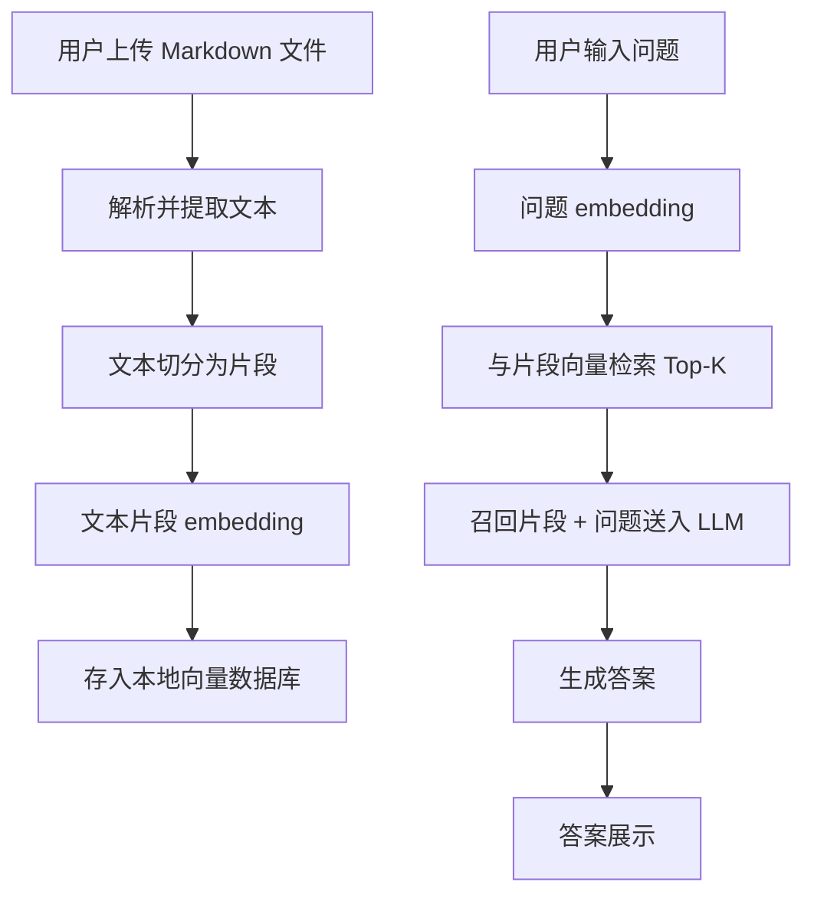

# 个人知识库助手项目设计报告

## 一、项目概述

本项目旨在实现一个基于本地 Markdown 文件的个人知识库问答助手。用户可上传自己的 Markdown 笔记文件，系统通过自然语言处理和语义检索，帮助用户快速、高效地从知识库中获取答案。整个应用通过 Streamlit 提供简明的交互界面，适合个人或小型团队知识管理、知识复用等场景。

---

## 二、功能需求

### 1. 文件上传与处理
- 支持用户上传本地 `.md` 格式的 Markdown 文件。
- 解析 Markdown 文件内容，提取纯文本（可保留基本结构，如标题、段落）。
- 对长内容进行自动分段（chunking）。

### 2. 知识向量化与存储
- 使用 OpenAI Embedding API 将文本片段转为向量。
- 向量数据存储于本地内存（无需持久化和云端数据库）。

### 3. 智能问答
- 用户在界面输入自然语言问题。
- 系统将问题转为向量，与片段向量做相似度检索（Top-K）。
- 检索到的相关片段与问题一并送入 LLM（如 GPT）生成最终答案。
- 将答案在界面展示。

### 4. 前端界面
- 使用 Streamlit 实现前端，支持文件上传、提问输入、答案展示。
- 支持上传多文件（可选，V1 可先支持单文件）。

---

## 三、技术选型

| 模块                | 技术/库          | 说明                                           |
|---------------------|------------------|------------------------------------------------|
| 前端                | Streamlit        | 快速构建数据应用界面，无需前端开发经验         |
| Markdown 解析       | markdown         | Python 标准包，或第三方库如 `markdown`         |
| 文本切分            | LangChain        | 使用 `RecursiveCharacterTextSplitter`          |
| Embedding           | OpenAI API       | 采用 `text-embedding-ada-002` 等 embedding 模型|
| 向量存储与检索      | 内存（list/array）| 采用 FAISS (可选)，V1 第一版可用 list 结构      |
| 语言模型问答        | OpenAI GPT       | 通过 OpenAI API 生成最终答案                   |

---

## 四、系统架构设计

### 1. 流程概述



### 2. 主要模块划分

#### 2.1 文件处理与文本抽取
- 负责接收上传的 `.md` 文件，并用 Markdown 解析库提取纯文本。

#### 2.2 文本切分
- 按字数/段落智能分割内容，保证每个片段有合理上下文。

#### 2.3 向量化
- 用 OpenAI Embedding API 将问题和文档片段分别转为向量。

#### 2.4 检索
- 计算问题向量与所有片段向量的余弦相似度，取 Top-K 最相关内容。

#### 2.5 问答生成
- 将召回片段和用户问题拼成 Prompt，调用 OpenAI LLM 生成答案。

#### 2.6 前端交互
- 用 Streamlit 实现文件上传、问题输入、答案显示等 UI。

---

## 五、伪代码与详细流程

### 1. 文件上传和处理

- 用户通过 Streamlit 上传 Markdown 文件
- 用 `markdown` 库解析内容，提取纯文本
- 用 LangChain TextSplitter 切分文本为片段

### 2. 文本嵌入与存储

- 遍历每个文本片段，使用 OpenAI Embedding 接口获取向量
- 将文本片段与其向量一起存入本地 list（如 `[(chunk, vector), ...]`）

### 3. 用户提问流程

- 用户输入问题
- 用 OpenAI Embedding 转换为向量
- 计算与所有片段向量的相似度，取 Top-K 最相关片段
- 将问题和相关片段合成为 Prompt，送入 OpenAI GPT 生成答案
- 返回并展示答案

---

## 六、核心代码结构建议

```text
personal_knowledge_assistant/
│
├── app.py                   # Streamlit 主程序，协调各模块
├── modules/
│   ├── markdown_loader.py   # Markdown 文件加载和文本提取
│   ├── text_splitter.py     # 文本切分
│   ├── embedder.py          # OpenAI Embedding 调用
│   ├── retriever.py         # 向量检索算法
│   ├── qa_chain.py          # 问答流程和 LLM 调用
│
├── requirements.txt         # 所需依赖库
├── README.md                # 项目说明
```

---

## 七、模块功能说明

### 1. markdown_loader.py
- `load_markdown(file) -> str`: 读取 Markdown 文件，返回纯文本内容

### 2. text_splitter.py
- `split_text(text, chunk_size=500, overlap=50) -> List[str]`: 切分文本为片段

### 3. embedder.py
- `get_embedding(text) -> np.array`: 调用 OpenAI API 获取文本向量

### 4. retriever.py
- `retrieve(query_embedding, doc_embeddings, top_k=3) -> List[int]`: 计算相似度，返回 Top-K 索引

### 5. qa_chain.py
- `generate_answer(question, context_chunks) -> str`: 组装 Prompt，调用 GPT 生成答案

### 6. app.py
- 负责 Streamlit UI，协调上传、提问、展示等交互流程

---

## 八、依赖库

- streamlit
- openai
- langchain
- markdown
- numpy

---

## 九、典型用户流程

1. 打开 Streamlit 应用
2. 上传本地 Markdown 笔记
3. 等待系统处理、切分、向量化
4. 在输入框输入问题
5. 系统检索相关片段，调用 LLM 生成答案
6. 用户获得答案

---

## 十、后续可扩展点

- 支持多文件批量上传和管理
- 支持多格式文件（PDF、HTML、Notion导出等）
- 向量持久化存储，支持增量更新
- 增加多轮上下文对话与记忆
- 本地化 LLM 或 Embedding，降低 API 成本

---

## 十一、关键注意事项

- OpenAI Embedding 和 GPT 接口调用需配置 API Key，并注意调用频率和 Token 限制
- 文本切分需兼顾上下文语义，避免答案片段过短或过长
- 片段召回建议 Top3-5，结果与问题一同输入 LLM 以获得更准确回答

---

# 总结

本项目设计专注于“本地 Markdown 文件+OpenAI embedding+Streamlit UI”，结构清晰，易于实现和扩展。后续可根据实际需求迭代支持更多格式、更多功能或本地化处理，逐步成长为个人专属的智能知识管理助手。
